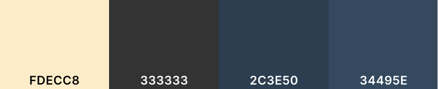
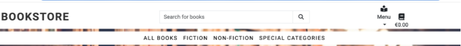
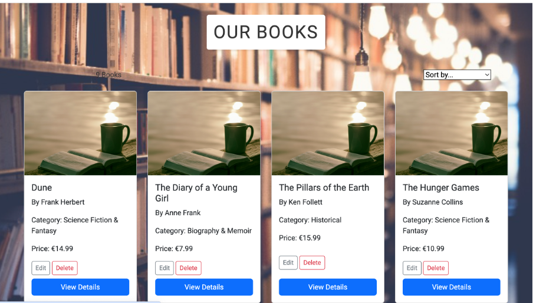

# The Bookstore

The Bookstore Wexford is an E-commerce site for a shop specialising in quality paperback books at affordable prices. The project aims to bring the joy of reading to book lovers both locally in Wexford and nationwide through an accessible, online platform.

Users can browse a wide range of books spanning various genres, from fiction and non-fiction to works by Irish authors and international bestsellers. They can easily add books to their cart and proceed to checkout.

A key focus of the project was to create a user-friendly front-end interface for the business owner. This allows them to manage the shop and update inventory without needing to access the Django Admin panel.

The Bookstore Wexford also integrates with another site, 'Book Blog', fostering a community of readers who can share their thoughts and find new literary inspirations. This integrated retail and community aspect creates a comprehensive platform for the book lovers.

[View the live project here](https://bookshop2-09bd4357cc3b.herokuapp.com)


## UX

The design of The Bookstore Wexford was created with the user experience in mind. The goal was to create an inviting, easy-to-navigate online bookshop that reflects the warm, welcoming atmosphere of a physical bookshop whilst providing the convenience of online shopping.


### Scope
Key features were identified to meet user needs:
- A comprehensive catalogue of books with detailed information
- Easy-to-use search and filter functions
- A streamlined checkout process
- Integration with the 'Book Blog' for community engagement

### Structure
The site is structured to guide users naturally from browsing to purchase:
- Home page introducing the bookshop and featuring highlighted books
- Catalogue pages with filter options
- Individual book pages with more detailed information
- Shopping basket and checkout process

### Skeleton
Wireframes were created for key pages to plan the layout and ensure a consistent, responsive design across devices.

### Surface
The visual design aims to create a calm, inviting atmosphere conducive to browsing books:
- A clean, uncluttered layout
- A colour scheme matched to the background image of a cosy reading space
- Typography that's easy to read 


### Colour Scheme

The colour palette for The Bookstore Wexford was carefully selected to complement the warm, inviting atmosphere of the background image, which depicts a cosy reading space. The chosen colours aim to create a sense of comfort, reminding users of a traditional bookshop:

- **Primary Background**: A soft, warm beige (`rgba(253, 236, 200, 0.9)`) is used for content containers, giving the feeling of aged paper and providing a gentle contrast to the text.

- **Primary Text**: Charcoal (`#333`) ensures readability while being softer than pure black, reducing eye strain during extended reading sessions.

- **Accent Colour**: A rich navy blue (`#2c3e50`) is used for buttons, headers, and interactive elements.

- **Accent Hover**: A slightly lighter blue (`#34495e`) is employed for hover states, providing feedback for interactive elements.

- **Footer Background**: The navy blue (`#2c3e50`) is repeated in the footer.

- **Footer Text**: Pure white (`#ffffff`) is used for footer text to ensure maximum contrast and readability against the dark background.

This colour scheme was chosen to create a harmonious, book-friendly environment that encourages browsing and reading, while ensuring accessibility and ease of use.

I used [coolors.co](https://coolors.co/fdecc8-333333-2c3e50-34495e-ffffff-000000) to generate my colour palette.



### Typography

The typography for The Bookstore Wexford was chosen to enhance readability and create a clean, modern aesthetic that complements the inviting atmosphere of the site:

- **Primary Font**: The main typeface used throughout the site is 'Roboto' which was chosen for its readability across screen sizes whilst maintaining a welcoming feel.

- **Fallback Fonts**: In the event that Roboto fails to load, the site falls back to the default sans-serif font of the user's system. This ensures that the text remains readable and the layout intact, regardless of the user's device or system settings.

- **Logo and Headers**: For the bookshop logo and main headers, uppercase styling with increased letter spacing (2px) was used. This distinguishes the look for important text elements, helping them stand out from the body and reinforcing brand identity.

- **Font Sizes**: The site uses a responsive typography scale, ensuring that text is legible on all devices. Font sizes are set in rem units, allowing for easy scaling based on the user's preferred browser settings.


## User Stories

## User Stories

### Site Users
 
- As a site user, I would like to easily navigate the site, so that I can find books I'm interested in quickly.
- As a site user, I would like to view a list of available books, so that I can select some to purchase.
- As a site user, I would like to search for specific books or authors, so that I can find what I'm looking for efficiently.
- As a site user, I would like to view detailed information about a book, so that I can make an informed decision before purchasing.
- As a site user, I would like to make a secure purchase, so that I can safely buy books online without worrying about my financial information.
 
### Site Admin
 
- As a site administrator, I should be able to add new books to the inventory, so that I can keep the selection up-to-date.
- As a site administrator, I should be able to edit book information, so that I can correct errors or update details as needed.
- As a site administrator, I should be able to remove books from the inventory, so that I can manage the available selection effectively.
- As a site administrator, I should be able to view and manage user accounts, so that I can assist with account-related issues.
- As a site administrator, I should be able to process orders and update their status, so that I can ensure efficient order fulfillment.

## Wireframes

# Wireframes

To follow best practice, wireframes were developed for mobile and desktop sizes.

I've used [Balsamiq](https://balsamiq.com/wireframes) to design my site wireframes.

### Mobile Wireframes

<details>
<summary>Click here to see the Mobile Wireframes</summary>

Home
  - 

Book Menu
  - 

Book Detail
  - 

Contact
  - 

</details>

### Desktop Wireframes

<details>
<summary>Click here to see the Desktop Wireframes</summary>

Home
  - 

Book Menu
  - 

Book Detail
  - 

Contact
  - 

</details>

## Features

## Existing Features

### Navigation Bar

- Featured on all pages, the fully responsive navigation bar includes links to the Logo, Home page, Books, Book Management (for superusers), User account, and Shopping basket.
- It is identical on each page to allow for easy navigation.
- This section will allow the user to easily navigate from page to page across all devices without having to revert back to the previous page via the 'back' button.

**Implementation**: The navigation bar is implemented in the `templates/includes/main-nav.html` file and included in the base template `templates/base.html`.



### The Landing Page

- The landing page features a hero image with text overlay, welcoming users to the Bookstore.
- This section introduces the user to The Bookstore with an eye-catching animation to grab their attention.

**Implementation**: The landing page is rendered by the `home` view in `home/views.py` and uses the template `home/templates/home/index.html`.


### Book Catalogue

- The book catalogue page displays all available books with their images, titles, authors, and prices.
- Users can sort books by price and search for specific titles or authors.

**Implementation**: The book catalogue is managed by the `all_books` view in `books/views.py` and displayed using the `books/templates/books/books.html` template. Sorting and searching functionality is handled in the same view.



### Book Details

- Each book has a detailed page showing its cover image, title, author, price, and description.
- Users can select the quantity and add the book to their basket from this page.

**Implementation**: Individual book details are displayed by the `book_detail` view in `books/views.py`, using the `books/templates/books/book_detail.html` template.


### Shopping Basket

- The shopping basket page shows all items the user has added to their basket.
- Users can update quantities or remove items from their basket.
- The page displays the subtotal, delivery cost, and grand total.

**Implementation**: The shopping basket functionality is handled by the `view_bookshelf`, `add_to_bookshelf`, `adjust_bookshelf`, and `remove_from_bookshelf` views in `bookshelf/views.py`. The template `bookshelf/templates/bookshelf/bookshelf.html` is used for display.


### Book Management (Admin)

- Superusers have access to add, edit, and delete books from the inventory.
- This feature allows for easy management of the bookstore's catalogue.

**Implementation**: Book management functionality is provided by the `add_book`, `edit_book`, and `delete_book` views in `books/views.py`, with corresponding templates in the `books/templates/books/` directory.


### Footer

- The footer section includes links to the relevant social media sites for The Bookstore.
- The footer is valuable to the user as it encourages them to keep connected via social media.

**Implementation**: The footer is included in the base template `templates/base.html`.


## Features Left to Implement

- Customer reviews and ratings for books
- Wishlist functionality for registered users
- Integration with a blog for book reviews and literary discussions
- Advanced search filters (e.g., by genre, publication date)
- Newsletter subscription for updates on new releases and promotions

## Tools & Technologies Used

## Tools & Technologies Used

- [](https://git-scm.com) used for version control. (`git add`, `git commit`, `git push`)
- [](https://github.com) used for secure online code storage.
- [](https://gitpod.io) used as a cloud-based IDE for development.
- [](https://en.wikipedia.org/wiki/HTML) used for the main site content.
- [](https://en.wikipedia.org/wiki/CSS) used for the main site design and layout.
- [](https://www.javascript.com) used for user interaction on the site.
- [](https://www.python.org) used as the back-end programming language.
- [](https://www.heroku.com) used for hosting the deployed back-end site.
- [](https://getbootstrap.com) used as the front-end CSS framework for modern responsiveness and pre-built components.
- [](https://www.djangoproject.com) used as the Python framework for the site.
- [](https://www.postgresql.org) used as the relational database management.
- [](https://aws.amazon.com/s3) used for online static file storage.
- [](https://fontawesome.com) used for icons.
- [](https://jquery.com) used for simplified DOM manipulation.
- [](https://stripe.com) used for online secure payments of ecommerce products/services.
- [](https://mail.google.com) used for sending emails in the application.
- [](https://whitenoise.readthedocs.io) used for serving static files with Heroku.

## Database Design

I have used `pygraphviz` and `django-extensions` to auto-generate an ERD.

The steps taken were as follows:
- In the terminal: `sudo apt update`
- then: `sudo apt-get install python3-dev graphviz libgraphviz-dev pkg-config`
- then type `Y` to proceed
- then: `pip3 install django-extensions pygraphviz`
- in my `settings.py` file, I added the following to my `INSTALLED_APPS`:
```python
INSTALLED_APPS = [
   ...
   'django_extensions',
   ...
]

```
- back in the terminal: `python3 manage.py graph_models -a -o erd.png`
- dragged the new `erd.png` file into my `documentation/` folder
- removed `'django_extensions',` from my `INSTALLED_APPS`
- finally, in the terminal: `pip3 uninstall django-extensions pygraphviz -y`


source: [medium.com](https://medium.com/@yathomasi1/1-using-django-extensions-to-visualize-the-database-diagram-in-django-application-c5fa7e710e16)


## Agile Development Process

### GitHub Projects

[GitHub Projects](https://github.com/A-Hebbes/book_store2/projects) was used as an Agile tool for this project.

Through GitHub Projects, user stories, issues, and milestone tasks were planned, then tracked on a regular basis using the Kanban board.


### GitHub Issues

[GitHub Issues](https://github.com/A-Hebbes/book_store2/issues) was used as another Agile tool.
There, I used my own **User Story Template** to manage user stories.

It also helped with milestone iterations on a weekly basis.

- [Open Issues](https://github.com/A-Hebbes/book_store2/issues) [](https://github.com/A-Hebbes/book_store2/issues)

   

- [Closed Issues](https://github.com/A-Hebbes/book_store2/issues?q=is%3Aissue+is%3Aclosed) [](https://github.com/A-Hebbes/book_store2/issues?q=is%3Aissue+is%3Aclosed)

   

### GitHub Milestones

GitHub Milestones were used to group related issues into larger epics, providing a clear overview of project progress across major functional areas. Three key milestones were created:

1. **Core E-commerce Functionality**
   - Encompassed all user account, shopping basket, and checkout features
   - Focused on essential buying and selling capabilities

2. **Book Management System**
   - Covered inventory control and admin functionalities
   - Included book detail pages and catalogue management

3. **User Interface Development**
   - Contained all navigation and search functionality
   - Included responsive design and user experience features

Each milestone was set with a due date of 20th October 2023, aligning with the project completion timeline. Issues were assigned to these milestones based on their functional area, allowing for clear tracking of progress across major project components.


The milestones helped maintain focus on delivering key functionality while providing a clear structure for tracking progress across different aspects of the project. This approach complemented the use of the GitHub Projects Kanban board and MoSCoW prioritisation, ensuring an organised development process.

### MoSCoW Prioritisation

I broke down my Epics into stories before to prioritising and implementing them.
In this way, I was able to apply the MoSCoW prioritisation and labels to my user stories within the Issues tab.

- **Must Have**: guaranteed to be delivered (*max 60% of stories*)
- **Should Have**: adds significant value, but not vital (*the rest ~20% of stories*)
- **Could Have**: has small impact if left out (*20% of stories*)
- **Won't Have**: not a priority for this iteration


## E-commerce Business Model

The Bookstore operates on a straightforward `Business to Customer` (B2C) model, offering books directly to individual readers. This approach focuses on single transactions, eschewing complex subscription models.

Despite being in its nascent stages, the website has already incorporated key features such as a newsletter sign-up and social media integration. These tools are crucial for building a robust online presence and fostering customer engagement.

The strategic use of social media platforms, particularly Facebook, has the potential to cultivate a community of book enthusiasts around the business. This not only increases website traffic but also helps to create a loyal customer base.

The newsletter will serve as a direct line of communication with customers, allowing The Bookstore to share various updates. These might include promotional offers on selected titles, announcements of new stock arrivals, changes to opening hours, or invitations to upcoming literary events.

As a Wexford-based enterprise, The Bookstore aims to strike a balance between serving its local community and expanding its reach through e-commerce. This dual-focused strategy allows the business to maintain its local identity while simultaneously growing its customer base beyond Wexford's borders.

A unique feature of The Bookstore is its connection to a dedicated book blog. This link provides customers with a platform to engage in literary discussions, share reviews, and discover new titles. The blog serves as an additional touchpoint for customer engagement, enhancing the overall book-buying experience and fostering a sense of community among readers.

By leveraging these digital tools alongside its physical presence, The Bookstore is well-positioned to create a unique blend of local charm and online accessibility in the book retail sector.

## Search Engine Optimization (SEO) & Social Media Marketing

### Keywords

I have identified some appropriate keywords which align with my site's intended use. These should help users
when searching online to find my page easily from a search engine.
The following keyword types were used:

- Short-tail (head terms) keywords:
   - Books
   - Bookshop
   - Wexford
   - Paperbacks
   - Bookstore
   - Reading

- Long-tail keywords:
   - Affordable books in Wexford
   - Local Wexford bookshop
   - Buy paperback books online
   - Independent bookstore Wexford
   - Best-selling novels in Ireland
   - Irish author book selection
   - Quality paperbacks at low prices
   - Online book ordering Wexford
   - Discover new authors Wexford
   - Literary community Wexford

### Sitemap

### Sitemap

To enhance search engine optimisation (SEO) for The Bookstore, I generated a sitemap.xml file using [XML-Sitemaps](https://www.xml-sitemaps.com). This process involved using my deployed site URL: https://bookshop2-09bd4357cc3b.herokuapp.com

The tool crawled through the entire website, creating a comprehensive [sitemap.xml](sitemap.xml) file. I've subsequently downloaded this file and incorporated it into the project repository. This sitemap will assist search engines in efficiently indexing the website's content, potentially improving its visibility in search results.

### Robots

In addition to the sitemap, I've created a [robots.txt](robots.txt) file and placed it at the root level of the project. This file contains the following default settings:

```
User-agent: *
Disallow:
Sitemap: https://bookshop2-09bd4357cc3b.herokuapp.com/sitemap.xml
```
These settings allow all web robots to access the entire website and provide the location of the sitemap for easy indexing.

For future enhancements of The Bookstore's SEO, I've identified the following resources:

- [Google Search Console](https://search.google.com/search-console) for monitoring and maintaining the site's presence in Google Search results
- [Creating and submitting a sitemap](https://developers.google.com/search/docs/advanced/sitemaps/build-sitemap) for detailed guidance on sitemap creation and submission
- [Managing your sitemaps and using sitemaps reports](https://support.google.com/webmasters/answer/7451001) for ongoing sitemap maintenance and analysis
- [Testing the robots.txt file](https://support.google.com/webmasters/answer/6062598) to ensure correct configuration and functionality of the robots.txt file

These tools and resources will be valuable for future optimisation of The Bookstore's online presence and search engine visibility.

### Social Media Marketing

### Social Media Marketing

Recognising the importance of social media in driving sales and increasing visibility, I've established a Facebook page for The Bookstore. This platform was chosen due to its wide user base and potential to maximise site views.


The Facebook page serves multiple purposes:
- It acts as a direct channel of communication with our customers
- Provides a platform to showcase new book arrivals and special offers
- Allows The Bookstore to share updates about in-store events or author signings
- Encourages community engagement through book discussions and reviews

The page has been set up to reflect The Bookstore's brand identity and includes:
- A similar aesthetic to the webiste
- A cover photo showcasing the interior of our Wexford shop
- Links back to our main website to drive traffic and potential sales


By maintaining an active presence on Facebook, The Bookstore aims to:
- Increase brand awareness
- Build a community of local and online book enthusiasts
- Drive traffic to the e-commerce site
- Enhance customer engagement and loyalty

You can find and follow The Bookstore's Facebook page [here](https://www.facebook.com/profile.php?id=61567552192724).

The plan would be to consistently update the Facebook page with engaging content to keep  followers informed and interested in what The Bookstore has to offer.

### Newsletter Marketing

A newsletter sign-up form has been incorporated into the website, allowing users to sign up to receive regular updates.

At present a newsletter email is triggered when a new book is added to the store. 


## Testing


## Deployment

### PostgreSQL Database

### Amazon AWS

#### S3 Bucket

#### IAM

#### Final AWS Setup

### Stripe API

### Gmail API

### Heroku Deployment

### Local Deployment

#### Cloning

#### Forking

### Local VS Deployment

## Credits

### Content

### Media

### Acknowledgements