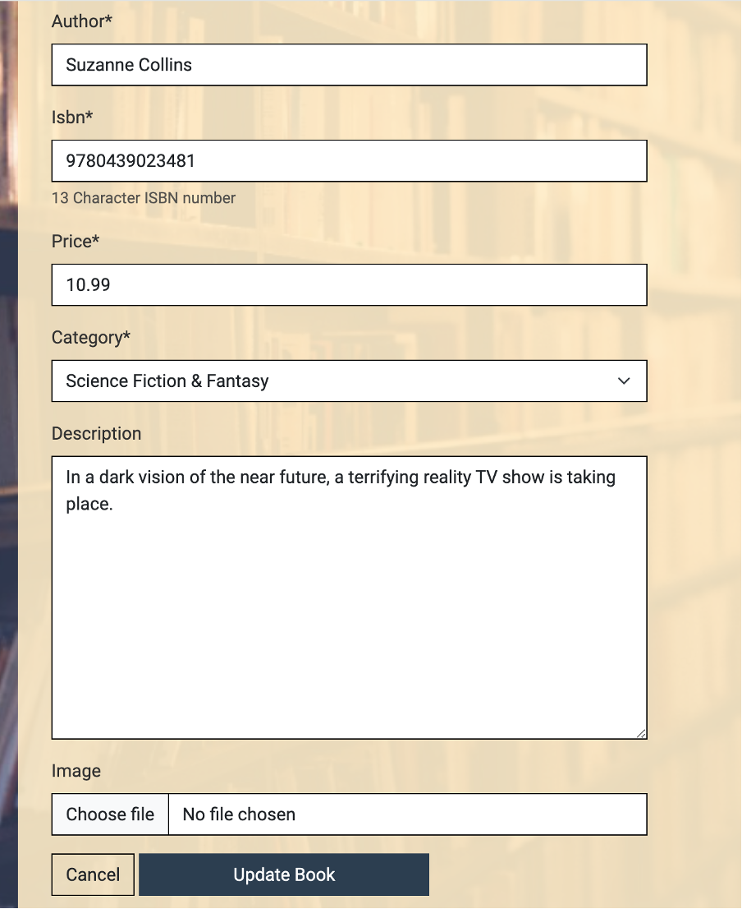
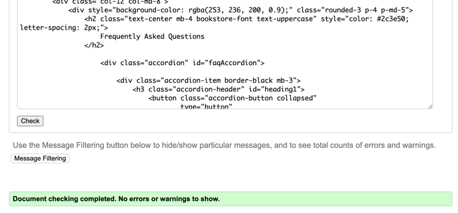

# The Bookstore

The Bookstore Wexford is an E-commerce site for a shop specialising in quality paperback books at affordable prices. The project aims to bring the joy of reading to book lovers both locally in Wexford and nationwide through an accessible, online platform.

Users can browse a wide range of books spanning various genres, from fiction and non-fiction to works by Irish authors and international bestsellers. They can easily add books to their cart and proceed to checkout.

A key focus of the project was to create a user-friendly front-end interface for the business owner. This allows them to manage the shop and update inventory without needing to access the Django Admin panel.

The Bookstore Wexford also integrates with another site, 'Book Blog', fostering a community of readers who can share their thoughts and find new literary inspirations. This integrated retail and community aspect creates a comprehensive platform for the book lovers.

[View the live project here](https://bookshop2-09bd4357cc3b.herokuapp.com)


## UX

The design of The Bookstore Wexford was created with the user experience in mind. The goal was to create an inviting, easy-to-navigate online bookshop that reflects the warm, welcoming atmosphere of a physical bookshop whilst providing the convenience of online shopping.


### Scope
Key features were identified to meet user needs:
- A comprehensive catalogue of books with detailed information
- Easy-to-use search and filter functions
- A streamlined checkout process
- Integration with the 'Book Blog' for community engagement

### Structure
The site is structured to guide users naturally from browsing to purchase:
- Home page introducing the bookshop and featuring highlighted books
- Catalogue pages with filter options
- Individual book pages with more detailed information
- Shopping basket and checkout process

### Skeleton
Wireframes were created for key pages to plan the layout and ensure a consistent, responsive design across devices.

### Surface
The visual design aims to create a calm, inviting atmosphere conducive to browsing books:
- A clean, uncluttered layout
- A colour scheme matched to the background image of a cosy reading space
- Typography that's easy to read 


### Colour Scheme

The colour palette for The Bookstore Wexford was carefully selected to complement the warm, inviting atmosphere of the background image, which depicts a cosy reading space. The chosen colours aim to create a sense of comfort, reminding users of a traditional bookshop:

- **Primary Background**: A soft, warm beige (`rgba(253, 236, 200, 0.9)`) is used for content containers, giving the feeling of aged paper and providing a gentle contrast to the text.

- **Primary Text**: Charcoal (`#333`) ensures readability while being softer than pure black, reducing eye strain during extended reading sessions.

- **Accent Colour**: A rich navy blue (`#2c3e50`) is used for buttons, headers, and interactive elements.

- **Accent Hover**: A slightly lighter blue (`#34495e`) is employed for hover states, providing feedback for interactive elements.

- **Footer Background**: The navy blue (`#2c3e50`) is repeated in the footer.

- **Footer Text**: Pure white (`#ffffff`) is used for footer text to ensure maximum contrast and readability against the dark background.

This colour scheme was chosen to create a harmonious, book-friendly environment that encourages browsing and reading, while ensuring accessibility and ease of use.

I used [coolors.co](https://coolors.co/fdecc8-333333-2c3e50-34495e-ffffff-000000) to generate my colour palette.


### Typography

The typography for The Bookstore Wexford was chosen to enhance readability and create a clean, modern aesthetic that complements the inviting atmosphere of the site:

- **Primary Font**: The main typeface used throughout the site is 'Roboto' which was chosen for its readability across screen sizes whilst maintaining a welcoming feel.

- **Fallback Fonts**: In the event that Roboto fails to load, the site falls back to the default sans-serif font of the user's system. This ensures that the text remains readable and the layout intact, regardless of the user's device or system settings.

- **Logo and Headers**: For the bookshop logo and main headers, uppercase styling with increased letter spacing (2px) was used. This distinguishes the look for important text elements, helping them stand out from the body and reinforcing brand identity.

- **Font Sizes**: The site uses a responsive typography scale, ensuring that text is legible on all devices. Font sizes are set in rem units, allowing for easy scaling based on the user's preferred browser settings.


## User Stories

## User Stories

### Site Users
 
- As a site user, I would like to easily navigate the site, so that I can find books I'm interested in quickly.
- As a site user, I would like to view a list of available books, so that I can select some to purchase.
- As a site user, I would like to search for specific books or authors, so that I can find what I'm looking for efficiently.
- As a site user, I would like to view detailed information about a book, so that I can make an informed decision before purchasing.
- As a site user, I would like to make a secure purchase, so that I can safely buy books online without worrying about my financial information.
 
### Site Admin
 
- As a site administrator, I should be able to add new books to the inventory, so that I can keep the selection up-to-date.
- As a site administrator, I should be able to edit book information, so that I can correct errors or update details as needed.
- As a site administrator, I should be able to remove books from the inventory, so that I can manage the available selection effectively.
- As a site administrator, I should be able to view and manage user accounts, so that I can assist with account-related issues.
- As a site administrator, I should be able to process orders and update their status, so that I can ensure efficient order fulfillment.

## Wireframes

# Wireframes

To follow best practice, wireframes were developed for mobile and desktop sizes.

I've used [Balsamiq](https://balsamiq.com/wireframes) to design my site wireframes.

### Mobile Wireframes

<details>
<summary>Click here to see the Mobile Wireframes</summary>

Home
  - 

Book Menu
  - 

Book Detail
  - 

Contact
  - 

</details>

### Desktop Wireframes

<details>
<summary>Click here to see the Desktop Wireframes</summary>

Home
  - 

Book Menu
  - 

Book Detail
  - 

Contact
  - 

</details>

## Features

## Existing Features

### Navigation Bar

- Featured on all pages, the fully responsive navigation bar includes links to the Logo, Home page, Books, Book Management (for superusers), User account, and Shopping basket.
- It is identical on each page to allow for easy navigation.
- This section will allow the user to easily navigate from page to page across all devices without having to revert back to the previous page via the 'back' button.

**Implementation**: The navigation bar is implemented in the `templates/includes/main-nav.html` file and included in the base template `templates/base.html`.


### The Landing Page

- The landing page features a hero image with text overlay, welcoming users to the Bookstore.
- This section introduces the user to The Bookstore with an eye-catching animation to grab their attention.

**Implementation**: The landing page is rendered by the `home` view in `home/views.py` and uses the template `home/templates/home/index.html`.


### Book Catalogue

- The book catalogue page displays all available books with their images, titles, authors, and prices.
- Users can sort books by price and search for specific titles or authors.

**Implementation**: The book catalogue is managed by the `all_books` view in `books/views.py` and displayed using the `books/templates/books/books.html` template. Sorting and searching functionality is handled in the same view.


### Book Details

- Each book has a detailed page showing its cover image, title, author, price, and description.
- Users can select the quantity and add the book to their basket from this page.

**Implementation**: Individual book details are displayed by the `book_detail` view in `books/views.py`, using the `books/templates/books/book_detail.html` template.


### Shopping Basket

- The shopping basket page shows all items the user has added to their basket.
- Users can update quantities or remove items from their basket.
- The page displays the subtotal, delivery cost, and grand total.

**Implementation**: The shopping basket functionality is handled by the `view_bookshelf`, `add_to_bookshelf`, `adjust_bookshelf`, and `remove_from_bookshelf` views in `bookshelf/views.py`. The template `bookshelf/templates/bookshelf/bookshelf.html` is used for display.


### Book Management (Admin)

- Superusers have access to add, edit, and delete books from the inventory.
- This feature allows for easy management of the bookstore's catalogue.

**Implementation**: Book management functionality is provided by the `add_book`, `edit_book`, and `delete_book` views in `books/views.py`, with corresponding templates in the `books/templates/books/` directory.



### Footer

- The footer section includes links to the relevant social media sites for The Bookstore.
- The footer is valuable to the user as it encourages them to keep connected via social media.

**Implementation**: The footer is included in the base template `templates/base.html`.


## Features Left to Implement

- Customer reviews and ratings for books
- Wishlist functionality for registered users
- Integration with a blog for book reviews and literary discussions
- Advanced search filters (e.g., by genre, publication date)
- Newsletter subscription for updates on new releases and promotions

## Tools & Technologies Used

## Tools & Technologies Used

- [](https://git-scm.com) used for version control. (`git add`, `git commit`, `git push`)
- [](https://github.com) used for secure online code storage.
- [](https://gitpod.io) used as a cloud-based IDE for development.
- [](https://en.wikipedia.org/wiki/HTML) used for the main site content.
- [](https://en.wikipedia.org/wiki/CSS) used for the main site design and layout.
- [](https://www.javascript.com) used for user interaction on the site.
- [](https://www.python.org) used as the back-end programming language.
- [](https://www.heroku.com) used for hosting the deployed back-end site.
- [](https://getbootstrap.com) used as the front-end CSS framework for modern responsiveness and pre-built components.
- [](https://www.djangoproject.com) used as the Python framework for the site.
- [](https://www.postgresql.org) used as the relational database management.
- [](https://aws.amazon.com/s3) used for online static file storage.
- [](https://fontawesome.com) used for icons.
- [](https://jquery.com) used for simplified DOM manipulation.
- [](https://stripe.com) used for online secure payments of ecommerce products/services.
- [](https://mail.google.com) used for sending emails in the application.
- [](https://whitenoise.readthedocs.io) used for serving static files with Heroku.

## Database Design

I have used `pygraphviz` and `django-extensions` to auto-generate an ERD.

The steps taken were as follows:
- In the terminal: `sudo apt update`
- then: `sudo apt-get install python3-dev graphviz libgraphviz-dev pkg-config`
- then type `Y` to proceed
- then: `pip3 install django-extensions pygraphviz`
- in my `settings.py` file, I added the following to my `INSTALLED_APPS`:
```python
INSTALLED_APPS = [
   ...
   'django_extensions',
   ...
]

```
- back in the terminal: `python3 manage.py graph_models -a -o erd.png`
- dragged the new `erd.png` file into my `documentation/` folder
- removed `'django_extensions',` from my `INSTALLED_APPS`
- finally, in the terminal: `pip3 uninstall django-extensions pygraphviz -y`


source: [medium.com](https://medium.com/@yathomasi1/1-using-django-extensions-to-visualize-the-database-diagram-in-django-application-c5fa7e710e16)


## Agile Development Process

### GitHub Projects

[GitHub Projects](https://github.com/A-Hebbes/book_store2/projects) was used as an Agile tool for this project.

Through GitHub Projects, user stories, issues, and milestone tasks were planned, then tracked on a regular basis using the Kanban board.


### GitHub Issues

[GitHub Issues](https://github.com/A-Hebbes/book_store2/issues) was used as another Agile tool.
There, I used my own **User Story Template** to manage user stories.

It also helped with milestone iterations on a weekly basis.

- [Open Issues](https://github.com/A-Hebbes/book_store2/issues) [](https://github.com/A-Hebbes/book_store2/issues)

   

- [Closed Issues](https://github.com/A-Hebbes/book_store2/issues?q=is%3Aissue+is%3Aclosed) [](https://github.com/A-Hebbes/book_store2/issues?q=is%3Aissue+is%3Aclosed)

   

### GitHub Milestones

GitHub Milestones were used to group related issues into larger epics, providing a clear overview of project progress across major functional areas. Three key milestones were created:

1. **Core E-commerce Functionality**
   - Encompassed all user account, shopping basket, and checkout features
   - Focused on essential buying and selling capabilities

2. **Book Management System**
   - Covered inventory control and admin functionalities
   - Included book detail pages and catalogue management

3. **User Interface Development**
   - Contained all navigation and search functionality
   - Included responsive design and user experience features

Each milestone was set with a due date of 20th October 2023, aligning with the project completion timeline. Issues were assigned to these milestones based on their functional area, allowing for clear tracking of progress across major project components.


The milestones helped maintain focus on delivering key functionality while providing a clear structure for tracking progress across different aspects of the project. This approach complemented the use of the GitHub Projects Kanban board and MoSCoW prioritisation, ensuring an organised development process.

### MoSCoW Prioritisation

I broke down my Epics into stories before to prioritising and implementing them.
In this way, I was able to apply the MoSCoW prioritisation and labels to my user stories within the Issues tab.

- **Must Have**: guaranteed to be delivered (*max 60% of stories*)
- **Should Have**: adds significant value, but not vital (*the rest ~20% of stories*)
- **Could Have**: has small impact if left out (*20% of stories*)
- **Won't Have**: not a priority for this iteration


## E-commerce Business Model

The Bookstore operates on a straightforward `Business to Customer` (B2C) model, offering books directly to individual readers. This approach focuses on single transactions, eschewing complex subscription models.

Despite being in its nascent stages, the website has already incorporated key features such as a newsletter sign-up and social media integration. These tools are crucial for building a robust online presence and fostering customer engagement.

The strategic use of social media platforms, particularly Facebook, has the potential to cultivate a community of book enthusiasts around the business. This not only increases website traffic but also helps to create a loyal customer base.

The newsletter will serve as a direct line of communication with customers, allowing The Bookstore to share various updates. These might include promotional offers on selected titles, announcements of new stock arrivals, changes to opening hours, or invitations to upcoming literary events.

As a Wexford-based enterprise, The Bookstore aims to strike a balance between serving its local community and expanding its reach through e-commerce. This dual-focused strategy allows the business to maintain its local identity while simultaneously growing its customer base beyond Wexford's borders.

A unique feature of The Bookstore is its connection to a dedicated book blog. This link provides customers with a platform to engage in literary discussions, share reviews, and discover new titles. The blog serves as an additional touchpoint for customer engagement, enhancing the overall book-buying experience and fostering a sense of community among readers.

By leveraging these digital tools alongside its physical presence, The Bookstore is well-positioned to create a unique blend of local charm and online accessibility in the book retail sector.

## Search Engine Optimization (SEO) & Social Media Marketing

### Keywords

I have identified some appropriate keywords which align with my site's intended use. These should help users
when searching online to find my page easily from a search engine.
The following keyword types were used:

- Short-tail (head terms) keywords:
   - Books
   - Bookshop
   - Wexford
   - Paperbacks
   - Bookstore
   - Reading

- Long-tail keywords:
   - Affordable books in Wexford
   - Local Wexford bookshop
   - Buy paperback books online
   - Independent bookstore Wexford
   - Best-selling novels in Ireland
   - Irish author book selection
   - Quality paperbacks at low prices
   - Online book ordering Wexford
   - Discover new authors Wexford
   - Literary community Wexford

### Sitemap

### Sitemap

To enhance search engine optimisation (SEO) for The Bookstore, I generated a sitemap.xml file using [XML-Sitemaps](https://www.xml-sitemaps.com). This process involved using my deployed site URL: https://bookshop2-09bd4357cc3b.herokuapp.com

The tool crawled through the entire website, creating a comprehensive [sitemap.xml](sitemap.xml) file. I've subsequently downloaded this file and incorporated it into the project repository. This sitemap will assist search engines in efficiently indexing the website's content, potentially improving its visibility in search results.

### Robots

In addition to the sitemap, I've created a [robots.txt](robots.txt) file and placed it at the root level of the project. This file contains the following default settings:

```
User-agent: *
Disallow:
Sitemap: https://bookshop2-09bd4357cc3b.herokuapp.com/sitemap.xml
```
These settings allow all web robots to access the entire website and provide the location of the sitemap for easy indexing.

For future enhancements of The Bookstore's SEO, I've identified the following resources:

- [Google Search Console](https://search.google.com/search-console) for monitoring and maintaining the site's presence in Google Search results
- [Creating and submitting a sitemap](https://developers.google.com/search/docs/advanced/sitemaps/build-sitemap) for detailed guidance on sitemap creation and submission
- [Managing your sitemaps and using sitemaps reports](https://support.google.com/webmasters/answer/7451001) for ongoing sitemap maintenance and analysis
- [Testing the robots.txt file](https://support.google.com/webmasters/answer/6062598) to ensure correct configuration and functionality of the robots.txt file

These tools and resources will be valuable for future optimisation of The Bookstore's online presence and search engine visibility.

### Social Media Marketing

### Social Media Marketing

Recognising the importance of social media in driving sales and increasing visibility, I've established a Facebook page for The Bookstore. This platform was chosen due to its wide user base and potential to maximise site views.


The Facebook page serves multiple purposes:
- It acts as a direct channel of communication with our customers
- Provides a platform to showcase new book arrivals and special offers
- Allows The Bookstore to share updates about in-store events or author signings
- Encourages community engagement through book discussions and reviews

The page has been set up to reflect The Bookstore's brand identity and includes:
- A similar aesthetic to the webiste
- A cover photo showcasing the interior of our Wexford shop
- Links back to our main website to drive traffic and potential sales


By maintaining an active presence on Facebook, The Bookstore aims to:
- Increase brand awareness
- Build a community of local and online book enthusiasts
- Drive traffic to the e-commerce site
- Enhance customer engagement and loyalty

You can find and follow The Bookstore's Facebook page [here](https://www.facebook.com/profile.php?id=61567552192724).

The plan would be to consistently update the Facebook page with engaging content to keep  followers informed and interested in what The Bookstore has to offer.

### Newsletter Marketing

A newsletter sign-up form has been incorporated into the website, allowing users to sign up to receive regular updates.

At present a newsletter email is triggered when a new book is added to the store. 


## Testing

I have used the recommended [HTML W3C Validator](https://validator.w3.org) to validate all of my HTML files.

| Directory | File | Screenshot | Notes |
| --- | --- | --- | --- |
| books | add_book.html |  | Passed validation with no errors |
| books | book_detail.html |  | Removed unnecessary type="text/javascript". All issues resolved. |
| books | books.html |  | Removed unnecessary type="text/javascript". All issues resolved. |
| books | edit_book.html |  | Passed validation with no errors. |
| bookshelf | bookshelf.html |  | Passed validation with no errors. |
| bookshop | index.html |  | Fixed duplicate ID issue with main-nav. All validation errors resolved.|
| checkout | checkout.html |  | Passed validation with no issues. |
| checkout | checkout_success.html |  | Passed validation with no issues. |
| contact | contact.html |  | Passed validation with no issues. |
| faq | faq.html |  | Passed validation with no issues. |
| newsletter | signup.html |  | Passed validation with no issues. |
| templates | 404.html |  | Passed validation with no issues. |


## Deployment

The live deployed application can be found deployed on [Heroku](https://bookshop2-09bd4357cc3b.herokuapp.com).

### Heroku Deployment

This project uses [Heroku](https://www.heroku.com), a platform as a service (PaaS) that enables developers to build, run, and operate applications entirely in the cloud.

Deployment steps are as follows, after account setup:

- Select **New** in the top-right corner of your Heroku Dashboard, and select **Create new app** from the dropdown menu.
- Your app name must be unique, and then choose a region closest to you (EU or USA), then finally, click **Create App**.
- From the new app **Settings**, click **Reveal Config Vars**, and set your environment variables to match your private `env.py` file.

> [!IMPORTANT]
> This is a sample only; you would replace the values with your own if cloning/forking my repository.

| Key | Value |
| --- | --- |
| `AWS_ACCESS_KEY_ID` | user-inserts-own-aws-access-key-id |
| `AWS_SECRET_ACCESS_KEY` | user-inserts-own-aws-secret-access-key |
| `DATABASE_URL` | user-inserts-own-postgres-database-url |
| `DISABLE_COLLECTSTATIC` | 1 (*this is temporary, and can be removed for the final deployment*) |
| `EMAIL_HOST_PASS` | user-inserts-own-gmail-api-key |
| `EMAIL_HOST_USER` | user-inserts-own-gmail-email-address |
| `SECRET_KEY` | any-random-secret-key |
| `STRIPE_PUBLIC_KEY` | user-inserts-own-stripe-public-key |
| `STRIPE_SECRET_KEY` | user-inserts-own-stripe-secret-key |
| `STRIPE_WH_SECRET` | user-inserts-own-stripe-webhook-secret |
| `USE_AWS` | True |

Heroku needs some additional files in order to deploy properly.

- [requirements.txt](requirements.txt)
- [Procfile](Procfile)

You can install this project's **[requirements.txt](requirements.txt)** (*where applicable*) using:

- `pip3 install -r requirements.txt`

If you have your own packages that have been installed, then the requirements file needs updated using:

- `pip3 freeze --local > requirements.txt`

The **[Procfile](Procfile)** can be created with the following command:

- `echo web: gunicorn app_name.wsgi > Procfile`
- *replace `app_name` with the name of your primary Django app name; the folder where `settings.py` is located*

For Heroku deployment, follow these steps to connect your own GitHub repository to the newly created app:

Either (*recommended*):

- Select **Automatic Deployment** from the Heroku app.

Or:

- In the Terminal/CLI, connect to Heroku using this command: `heroku login -i`
- Set the remote for Heroku: `heroku git:remote -a app_name` (*replace `app_name` with your app name*)
- After performing the standard Git `add`, `commit`, and `push` to GitHub, you can now type:
	- `git push heroku main`

The project should now be connected and deployed to Heroku!

### PostgreSQL

This project uses a [Code Institute PostgreSQL Database](https://dbs.ci-dbs.net) for the Relational Database with Django.

> [!CAUTION]
> - PostgreSQL databases by Code Institute are only available to CI Students.
> - You must acquire your own PostgreSQL database through some other method if you plan to clone/fork this repository.
> - Code Institute students are allowed a maximum of 8 databases.
> - Databases are subject to deletion after 18 months.

To obtain my own Postgres Database from Code Institute, I followed these steps:

- Submitted my email address to the CI PostgreSQL Database link above.
- An email was sent to me with my new Postgres Database.
- The Database connection string will resemble something like this:
    - `postgres://<db_username>:<db_password>@<db_host_url>/<db_name>`
- You can use the above URL with Django; simply paste it into your `env.py` file and Heroku Config Vars as `DATABASE_URL`.

### Amazon AWS

This project uses [AWS](https://aws.amazon.com) to store media and static files online, due to the fact that Heroku doesn't persist this type of data.

Once you've created an AWS account and logged-in, follow these series of steps to get your project connected. Make sure you're on the **AWS Management Console** page.

#### S3 Bucket

- Search for **S3**.
- Create a new bucket, give it a name (e.g. matching your Heroku app name), and choose the region closest to you.
- Uncheck **Block all public access**, and acknowledge that the bucket will be public (*required* for it to work on Heroku).
- From **Object Ownership**, make sure to have **ACLs enabled**, and **Bucket owner preferred** selected.
- From the **Properties** tab, turn on static website hosting, and type `index.html` and `error.html` in their respective fields, then click **Save**.
- From the **Permissions** tab, paste in the following CORS configuration:

	```shell
	[
		{
			"AllowedHeaders": [
				"Authorization"
			],
			"AllowedMethods": [
				"GET"
			],
			"AllowedOrigins": [
				"*"
			],
			"ExposeHeaders": []
		}
	]
	```

- Copy your **ARN** string.
- From the **Bucket Policy** tab, select the **Policy Generator** link, and use the following steps:
	- Policy Type: **S3 Bucket Policy**
	- Effect: **Allow**
	- Principal: `*`
	- Actions: **GetObject**
	- Amazon Resource Name (ARN): **paste-your-ARN-here**
	- Click **Add Statement**
	- Click **Generate Policy**
	- Copy the entire Policy, and paste it into the **Bucket Policy Editor**

		```shell
		{
			"Id": "Policy1234567890",
			"Version": "2012-10-17",
			"Statement": [
				{
					"Sid": "Stmt1234567890",
					"Action": [
						"s3:GetObject"
					],
					"Effect": "Allow",
					"Resource": "arn:aws:s3:::your-bucket-name/*"
					"Principal": "*",
				}
			]
		}
		```

	- Before you click "Save", add `/*` to the end of the Resource key in the Bucket Policy Editor (*like above*).
	- Click **Save**.
- From the **Access Control List (ACL)** section, click "Edit" and enable **List** for **Everyone (public access)**, and accept the warning box.
	- If the edit button is disabled, you need to change the **Object Ownership** section above to **ACLs enabled** (*mentioned above*).

#### IAM

Back on the AWS Services Menu, search for and open **IAM** (Identity and Access Management). Once on the IAM page, follow these steps:

- From **User Groups**, click **Create New Group**.
	- Suggested Name: `group-book_store2` (*group + the project name*)
- Tags are optional, but you must click it to get to the **review policy** page.
- From **User Groups**, select your newly created group, and go to the **Permissions** tab.
- Open the **Add Permissions** dropdown, and click **Attach Policies**.
- Select the policy, then click **Add Permissions** at the bottom when finished.
- From the **JSON** tab, select the **Import Managed Policy** link.
	- Search for **S3**, select the `AmazonS3FullAccess` policy, and then **Import**.
	- You'll need your ARN from the S3 Bucket copied again, which is pasted into "Resources" key on the Policy.

		```shell
		{
			"Version": "2012-10-17",
			"Statement": [
				{
					"Effect": "Allow",
					"Action": "s3:*",
					"Resource": [
						"arn:aws:s3:::your-bucket-name",
						"arn:aws:s3:::your-bucket-name/*"
					]
				}
			]
		}
		```
	
	- Click **Review Policy**.
	- Suggested Name: `policy-book_store2` (*policy + the project name*)
	- Provide a description:
		- "Access to S3 Bucket for book_store2 static files."
	- Click **Create Policy**.
- From **User Groups**, click your "group-book_store2".
- Click **Attach Policy**.
- Search for the policy you've just created ("policy-book_store2") and select it, then **Attach Policy**.
- From **User Groups**, click **Add User**.
	- Suggested Name: `user-book_store2` (*user + the project name*)
- For "Select AWS Access Type", select **Programmatic Access**.
- Select the group to add your new user to: `group-book_store2`
- Tags are optional, but you must click it to get to the **review user** page.
- Click **Create User** once done.
- You should see a button to **Download .csv**, so click it to save a copy on your system.
	- **IMPORTANT**: once you pass this page, you cannot come back to download it again, so do it immediately!
	- This contains the user's **Access key ID** and **Secret access key**.
	- `AWS_ACCESS_KEY_ID` = **Access key ID**
	- `AWS_SECRET_ACCESS_KEY` = **Secret access key**

#### Final AWS Setup

- If Heroku Config Vars has `DISABLE_COLLECTSTATIC` still, this can be removed now, so that AWS will handle the static files.
- Back within **S3**, create a new folder called: `media`.
- Select any existing media images for your project to prepare them for being uploaded into the new folder.
- Under **Manage Public Permissions**, select **Grant public read access to this object(s)**.
- No further settings are required, so click **Upload**.

### Stripe API

This project uses [Stripe](https://stripe.com) to handle the ecommerce payments.

Once you've created a Stripe account and logged-in, follow these series of steps to get your project connected.

- From your Stripe dashboard, click to expand the "Get your test API keys".
- You'll have two keys here:
	- `STRIPE_PUBLIC_KEY` = Publishable Key (starts with **pk**)
	- `STRIPE_SECRET_KEY` = Secret Key (starts with **sk**)

As a backup, in case users prematurely close the purchase-order page during payment, we can include Stripe Webhooks.

- From your Stripe dashboard, click **Developers**, and select **Webhooks**.
- From there, click **Add Endpoint**.
	- `https://bookshop2-09bd4357cc3b.herokuapp.com/checkout/wh/`
- Click **receive all events**.
- Click **Add Endpoint** to complete the process.
- You'll have a new key here:
	- `STRIPE_WH_SECRET` = Signing Secret (Wehbook) Key (starts with **wh**)

### Gmail API

This project uses [Gmail](https://mail.google.com) to handle sending emails to users for purchase order confirmations.

Once you've created a Gmail (Google) account and logged-in, follow these series of steps to get your project connected.

- Click on the **Account Settings** (cog icon) in the top-right corner of Gmail.
- Click on the **Accounts and Import** tab.
- Within the section called "Change account settings", click on the link for **Other Google Account settings**.
- From this new page, select **Security** on the left.
- Select **2-Step Verification** to turn it on. (*verify your password and account*)
- Once verified, select **Turn On** for 2FA.
- Navigate back to the **Security** page, and you'll see a new option called **App passwords** (*search for it at the top, if not*).
- This might prompt you once again to confirm your password and account.
- Select **Mail** for the app type.
- Select **Other (Custom name)** for the device type.
    - Any custom name, such as "Django" or `book_store2`
- You'll be provided with a 16-character password (API key).
    - Save this somewhere locally, as you cannot access this key again later!
    - If your 16-character password contains *spaces*, make sure to remove them entirely.
    - `EMAIL_HOST_PASS` = user's 16-character API key
    - `EMAIL_HOST_USER` = user's own personal Gmail email address

### WhiteNoise

This project uses the [WhiteNoise](https://whitenoise.readthedocs.io/en/latest/) to aid with static files temporarily hosted on the live Heroku site.

To include WhiteNoise in your own projects:

- Install the latest WhiteNoise package:
    - `pip install whitenoise`
- Update the `requirements.txt` file with the newly installed package:
    - `pip freeze --local > requirements.txt`
- Edit your `settings.py` file and add WhiteNoise to the `MIDDLEWARE` list, above all other middleware (apart from Django’s "SecurityMiddleware"):

```python
# settings.py

MIDDLEWARE = [
    'django.middleware.security.SecurityMiddleware',
    'whitenoise.middleware.WhiteNoiseMiddleware',
    # any additional middleware
]
```


### Local Development

This project can be cloned or forked in order to make a local copy on your own system.

For either method, you will need to install any applicable packages found within the [requirements.txt](requirements.txt) file.

- `pip3 install -r requirements.txt`.

You will need to create a new file called `env.py` at the root-level, and include the same environment variables listed above from the Heroku deployment steps.

> [!IMPORTANT]
> This is a sample only; you would replace the values with your own if cloning/forking my repository.

Sample `env.py` file:

```python
import os

os.environ.setdefault("AWS_ACCESS_KEY_ID", "user-inserts-own-aws-access-key-id")
os.environ.setdefault("AWS_SECRET_ACCESS_KEY", "user-inserts-own-aws-secret-access-key")
os.environ.setdefault("DATABASE_URL", "user-inserts-own-postgres-database-url")
os.environ.setdefault("EMAIL_HOST_PASS", "user-inserts-own-gmail-host-api-key")
os.environ.setdefault("EMAIL_HOST_USER", "user-inserts-own-gmail-email-address")
os.environ.setdefault("SECRET_KEY", "any-random-secret-key")
os.environ.setdefault("STRIPE_PUBLIC_KEY", "user-inserts-own-stripe-public-key")
os.environ.setdefault("STRIPE_SECRET_KEY", "user-inserts-own-stripe-secret-key")

# local environment only (do not include these in production/deployment!)

os.environ.setdefault("DEBUG", "True")
os.environ.setdefault("DEVELOPMENT", "True")
```

Once the project is cloned or forked, in order to run it locally, you'll need to follow these steps:

- Start the Django app: `python3 manage.py runserver`
- Stop the app once it's loaded: `CTRL+C` (*Windows/Linux*) or `⌘+C` (*Mac*)
- Make any necessary migrations: `python3 manage.py makemigrations --dry-run` then `python3 manage.py makemigrations`
- Migrate the data to the database: `python3 manage.py migrate --plan` then `python3 manage.py migrate`
- Create a superuser: `python3 manage.py createsuperuser`
- Load fixtures (*if applicable*): `python3 manage.py loaddata file-name.json` (*repeat for each file*)
- Everything should be ready now, so run the Django app again: `python3 manage.py runserver`

If you'd like to backup your database models, use the following command for each model you'd like to create a fixture for:

- `python3 manage.py dumpdata your-model > your-model.json`
- *repeat this action for each model you wish to backup*
- **NOTE**: You should never make a backup of the default *admin* or *users* data with confidential information.

#### Cloning

You can clone the repository by following these steps:

1. Go to the [GitHub repository](https://www.github.com/A-Hebbes/book_store2).
2. Locate and click on the green "Code" button at the very top, above the commits and files.
3. Select whether you prefer to clone using "HTTPS", "SSH", or "GitHub CLI", and click the "copy" button to copy the URL to your clipboard.
4. Open "Git Bash" or "Terminal".
5. Change the current working directory to the location where you want the cloned directory.
6. In your IDE Terminal, type the following command to clone the repository:
	- `git clone https://www.github.com/A-Hebbes/book_store2.git`
7. Press "Enter" to create your local clone.

Alternatively, if using Gitpod, you can click below to create your own workspace using this repository.

[](https://gitpod.io/#https://www.github.com/A-Hebbes/book_store2)

**Please Note**: in order to directly open the project in Gitpod, you should have the browser extension installed. A tutorial on how to do that can be found [here](https://www.gitpod.io/docs/configure/user-settings/browser-extension).

#### Forking

By forking the GitHub Repository, you make a copy of the original repository on our GitHub account to view and/or make changes without affecting the original owner's repository. You can fork this repository by using the following steps:

1. Log in to GitHub and locate the [GitHub Repository](https://www.github.com/A-Hebbes/book_store2).
2. At the top of the Repository, just below the "Settings" button on the menu, locate and click the "Fork" Button.
3. Once clicked, you should now have a copy of the original repository in your own GitHub account!

### Local VS Deployment

There are no remaining major differences between the local version when compared to the deployed version online.

## Credits

### Content

### Media

### Acknowledgements